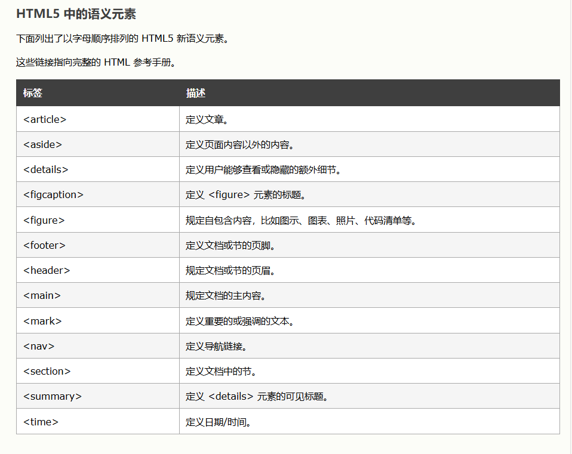

# html

html是用来描述网页的一种语言
- html指的是超文本标记语言(HyperText Markup Language)
- html不是编程语言，而是一种**标记语言**
- 标记语言是一套**标记标签**
- html使用**标记标签**来描述网页

html标签是由尖括号包围的关键词，比如 <html>，通常是成对出现的，比如 <b> 和 </b>，标签对中的第一个是开始标签，第二个是结束标签  

开始标签和结束标签之间的代码叫做 html元素

html标签可以拥有**属性**，属性总以名称/值对的形式出现，比如：name="value"，属性总在 HTML 元素的开始标签中规定

Web 浏览器的作用是读取 HTML 文档，并以网页的形式显示出它们。浏览器不会显示 HTML 标签，而是使用标签来解释页面的内容

通过浏览器右键查看源码，可以打开html源码窗口  

---

## 标签

### \<html>标签

<html> 标签表示 HTML 文档的根（根元素），它表示文档中的 HTML 部分的开始  

<html> 标签是所有其他 HTML 元素的容器(除了 <!DOCTYPE> 标签)，之间是文档的头部和主体

应该始终在 <html> 标签内包含 lang 属性，以声明网页的语言

---

### \<head>标签

head 内的元素可包含脚本，指示浏览器在何处可以找到样式表，提供元信息，等等

- `<title>`: 显示在搜索引擎结果中的页面标题
  - 一个 html 文件只能有一个 title
- `<base>`: 为页面上的所有链接规定默认地址或默认目标

```html
<head>
<base href="http://www.w3school.com.cn/images/" />
<base target="_blank" />
</head>
```

- `<link>`: 定义文档与外部资源之间的关系，常用于连接样式表
- `<style>`: 在 style 元素内规定 HTML 元素在浏览器中呈现的样式
- `<meta>`: 提供关于 HTML 文档的元数据
  - `charset`: 规定 HTML 文档的字符编码


### \<body>标签

HTML 文档的元数据和文档信息包装在 head 元素中，文档的内容则包装在 body 元素中，例如标题、段落、图像、超链接、表格、列表等

一个 HTML 文档中只能有一个 <body> 元素

---

### 标题

用h1-6表示不同级标题

```html
<h1>This is a heading</h1>
<h2>This is a heading</h2>
<h3>This is a heading</h3>
```

浏览器会自动地在标题的前后添加空行  

默认情况下，HTML 会自动地在块级元素前后添加一个额外的空行，比如段落、标题元素前后  

用户可以通过标题来快速浏览您的网页

---

### 段落

```html
<p>This is a paragraph.</p>
<p>This is another paragraph.</p>
```

如果希望在不产生一个新段落的情况下进行换行，使用 <br /> 标签

```html
<p>This is<br />a para<br />graph with line breaks</p>
```

浏览器会移除源代码中多余的空格和空行，所有连续的空格或空行都会被算作一个空格

---

### 水平线

hr(horizontal(水平线) rule) 水平尺

```html
<p>This is a paragraph</p>
<hr />
<p>This is a paragraph</p>
```

---

### 注释

浏览器会忽略注释，不会显示它们

```html
<!-- This is a comment -->
```

---

### 预格式文本

pre 定义预先格式化的文本，以等宽字体显示，文本保留空格和换行符

```html
<pre>
    for (int i = 0; i < n; i++) {
        cout << i << endl;
    }
</pre>
```

---

### 引用与定义

\<q> 定义短引用，浏览器通常会为 \<q> 元素包围引号  

\<blockquote> 定义引用块，浏览器通常会对 \<blockquote> 元素进行缩进处理

```html
<p>This is：<q>kaf</q></p>
<p>it's her introduction：</p>
<blockquote cite="/kaf.jpg">
so cute! so kind!
</blockquote>
```

<dfn> 定义缩写的含义

```html
<p><dfn title="my wife">kaf</dfn></p>
```

---

### 链接

a(anchor 锚定)，用于创建超链接

href(hypertext reference) 属性，指定超链接目标的URL  

download 属性，规定用户单击超链接时下载目标，指定 download 属性的值，是下载文件时的新文件名 

```html
<!--可以使用绝对URL或者相对URL-->
<a href="http://www.w3school.com.cn">访问w3school</a>
<a href="/kaf.jpg" download>
<!--链接同一页面的特定位置-->
<a href="#section2">跳到第二部分</a>
<!--执行 JavaScript 代码-->
<a href="javascript:alert('Hello World!');">执行 JavaScript</a>
```

对于 JavaScript 来说，也可以利用 \<script> 标签

target 属性，指定被链接文档在何处显示  
- `_blank`: 在新窗口或选项卡中打开链接文档
- `_self`: 在与点击相同的框架中打开链接的文档（默认）

```html
<a href="http://www.w3school.com.cn/" target="_blank">Visit W3School!</a>
```

name 属性，创建书签，对读者不可见，创建书签后，可以创建直接跳转至该书签的链接

```html
<!--在 HTML 文档中对锚进行命名（创建一个书签）-->
<a name="tips">基本的注意事项 - 有用的提示</a>
<!--在同一个文档中创建指向该锚的链接-->
<a href="#tips">有用的提示</a>
```

对于其他元素，可以使用 id 属性，与 name 效果一样

---

### 图像

\ 是空标签，只包含属性  

src(source) 属性，指定URL地址  

alt 属性用于为图像定义预备的可替换文本  

```html

```

可以通过 align, width, height 来调整图片对齐和大小

还可以在链接中嵌入图片，将图片作为链接使用  

```html
<a href="/https://bilibili.com">  </a>
```

更进一步，可以利用 \<map> 来创建图像映射  

name 属性用于 \ usemap 属性关联，在图像和地图之间创建关系  

```html

<map name="kafmap">
  <area shape="rect" coords="10,208,155,338" alt="bilibili" href="https://bilibili.com">
  <area shape="rect" coords="214,65,364,365" alt="zhihu" href="https://zhihu.com">
  <area shape="circle" coords="570,291,75" alt="github" href="https://github.com">
</map>
```


- `shape`: 规定区域的形状
  - `default, rect, circle, poly`
- `coords`: 坐标值，规定区域的坐标，不同图形有不同坐标类型
  - `x1, y1, x2, y2`: 规定矩形左上角和右下角的坐标
  - `x, y, radius`: 规定圆心的坐标和半径
  - `x1, y1, x2, y2,...,xn, yn`: 多边形的坐标

---

### 表格

caption(标题，字幕) 添加标题

th(table heading) 表头，大多数浏览器会把表头显示为粗体居中  

tr(table row) 表示一行  

td(table data) 表示表格数据，即单元格的内容，可以包括文本，图片，列表，段落等等  

border(边框) 属性，值越大，边框越粗

```html
<table border="1">
<caption>title</caption>
<th>Heading</th>
<th>Another Heading</th>
<tr>
<td>row 1, cell 1</td>
<td>row 1, cell 2</td>
</tr>
<tr>
<td>row 2, cell 1</td>
<td>row 2, cell 2</td>
</tr>
</table>
```

对于空白单元格，尽量用 \<nbsp;> 去占位，以防显示不出边框  

---

### 列表

**无序列表** ul(unorder list)  

```html
<ul>
<li>one kekdou</li>
<li>two kekdou</li>
</ul>
```
**有序列表** ol(order list)  

```html
<ol>
<li>one kekdou</li>
<li>two kekdou</li>
</ol>
```

**定义列表** dl(define list)  

```html
<dl>
<dt>Coffee</dt>
<dd>Black hot drink</dd>
<dt>Milk</dt>
<dd>White cold drink</dd>
</dl>
```

---

### 块与内联

div(division) 能将html元素组合起来，与css一同使用可以对大的内容块设置样式属性  

span 与div相似，不过作用于行内(内联元素)

```html
<head>
<style>
.myDiv {
  border: 5px outset red;
  background-color: lightblue;
  text-align: center;
}
</style>
</head>
<body>
<div class="myDiv">
  <h2>这是 div 元素中的标题</h2>
  <p>这是 div 元素中的一些文本。</p>
</div>
</body>
```

只要属于一类(class) 的块，都可以使用 myDiv 进行格式化，非常方便  

利用块来对页面进行布局也是十分推荐的，如\<div id="nav"> \<div class="header"> \<div id="aside"> 等  

  

---

### 框架

使用框架，可以在同一个浏览器中显示不止一个页面  

```html
<html>
<frameset rows="50%,50%">
<frame src="/example/html/frame_a.html">
<frameset cols="25%,75%">
<frame src="/example/html/frame_b.html">
<frame src="/example/html/frame_c.html">
</frameset>
</frameset>
</html>
```

框架是可以拖动改变的，如果不想改变框架大小，可以加上 noresize="noresize" 属性和值  


---

### 内联框架

用于在网页内显示网页

```html
<iframe src="demo_iframe.htm" width="200" height="200"></iframe>
```

---

### 文本格式化

|标签|描述|
|:---|:---|
|<b>/<strong>|定义粗体文本|
|<i>/<em>|定义斜体字|
|<sub>/<sup>|定义下/上标字|
|<big>/<small>|定义大/小号字|
|<del>/<ins>|定义删除线/下滑线|

```html
<html>
<body>
<b>This text is bold</b>
<br />
<i>This text is italic</i>
<br />
This text is <del>del</del> <ins>ins</ins>
</body>
</html>
```

---

### 样式

html可以将所有格式化代码移入独立的样式表  

**外部样式表**  

当样式需要应用到很多页面的时候，外部样式表将是理想的选择，通过更改一个文件来改变整个站点的外观  

<link> 定义资源引用

```html
<head>
<link rel="stylesheet" type="text/css" href="mystyle.css">
</head>
```

**内部样式表**  

可以在 head 部分通过 <style> 标签定义内部样式表  

```html
<head>
<style type="text/css">
body {background-color: red}
p {margin-left: 20px}
</style>
</head>
```

**内联样式**  

个别元素需要应用特殊的样式时，可以使用样式属性，样式属性可以包含任何css属性   
- `background-color`: 背景颜色
- `font-family`: 文本的字体系列
- `color`: 文本的颜色
- `font-size`: 文本的字体尺寸
- `text-align`: 文本的水平对齐方式

```html
<p style="color: red; margin-left: 20px">
This is a paragraph
</p>
```

颜色由红，绿，蓝混合而成rgb(x,y,z)，其中 $0 \le x,y,z \le 255$  

使用16进制表示，#FF0000 = rgb(255,0,0)，#00FF00 = rgb(0,255,0)，#0000FF = rgb(0,0,255)  

web安全色支持216种，不过做选择的还是自己(随便用)  

一些常用的颜色有自己的颜色名  

---
