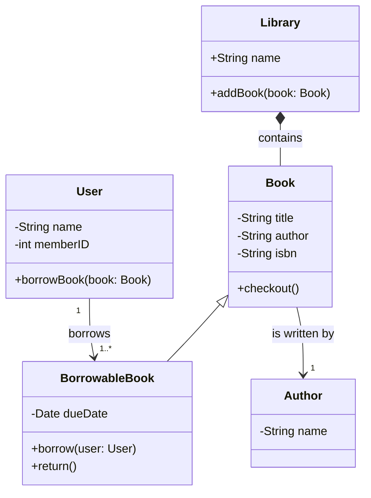

### 类图

类图是统一建语言（UML）中表示系统结构的静态图，用于描述面向对象系统中类，接口以及之间关系的图  

1. 定义图表类型：使用 `classDiagram`定义类图

2. 定义类
	- 定义类名：使用 `class`关键字
	- 定义成员：在类名后面跟上大括号 `{}`，然后在里面定义成员  
		- 字段：`可见性 字段名：类型`
		- 方法： `可见性 方法名（参数）：返回类型`
		- 可见修饰符：
			- `+`：公共
			- `-`：私有
			- `#`：保护

3. 定义关系
	- `A --|> B`：表示A继承自B
	- `A *-- B`：表示A由B组成
	- `A o-- B`：表示A聚合B
	- `A --->` ：表示A关联B

4. 演示代码

```
classDiagram
    class Library {
        +String name
        +addBook(book: Book)
    }

    class Book {
        -String title
        -String author
        -String isbn
        +checkout()
    }

    class BorrowableBook {
        -Date dueDate
        +borrow(user: User)
        +return()
    }

    class User {
        -String name
        -int memberID
        +borrowBook(book: Book)
    }
    
    class Author {
        -String name
    }

    Library *-- Book : contains
    Book <|-- BorrowableBook
    User "1" --> "1..*" BorrowableBook : borrows
    Book --> "1" Author : is written by
```



---
