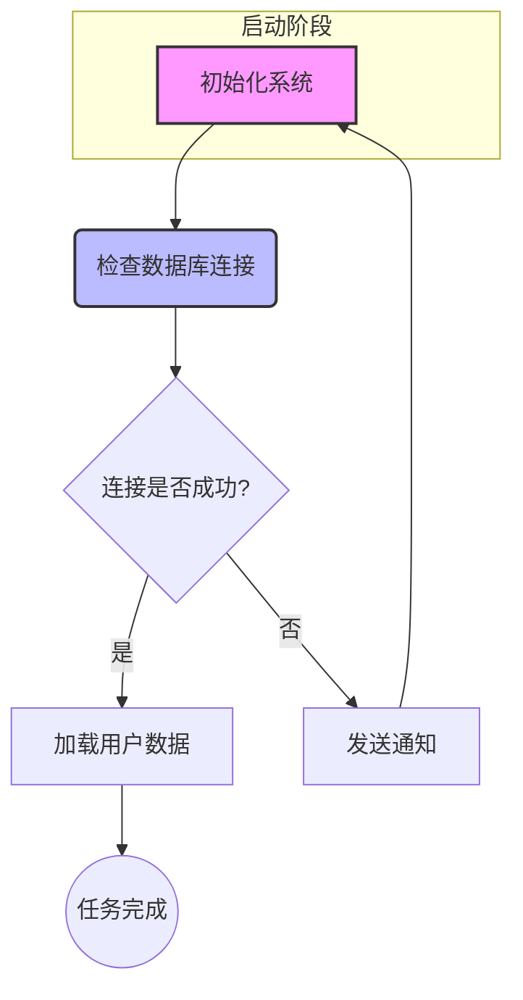

### 流程图（flowchart）  

流程图是最常用的图表之一，将一个复杂、抽象的过程或算法，以直观、易懂的方式呈现出来  

1. 定义图表类型和方向：流程图以 `graph`关键字开头，紧接着图表的方向   
	- `graph TD`：从上到下（Top-Down）
	- `graph LR`：从左到右
	- `graph RL`：从右到左
	- `graph BT`：从下到上（Bottom-Top） 

2. 定义节点：节点是流程图的基本组成部分，mermaid提供多种形状的节点   
	- `id[文本]`：矩形节点，`id`是节点唯一标识符，文本是显示在节点内部的文字
	- `id(文本)`：圆角矩形节点
	- `id{文本}`：菱形节点，用于决策和判断
	- `id((文本))`：圆形节点  

3. 定义连接线：连接线用于表示流程的流向    
	- `A ---> B`：实线箭头
	- `A --- B`：实现无箭头
	- `A -- 文本 --> B`：带文本标签的实线箭头
	- `A -.-> B`：虚线箭头
	- `A -. 文本 .-> B`：带文本标签的虚线箭头  

4. 演示代码  

```
graph TD
	subgraph 启动阶段
		A[初始化系统]
	end
	
	B(检查数据库连接)
	C{连接是否成功？}
	D[加载用户数据]
	E((任务完成))
	F[发送通知]
	
	A ---> B
	B ---> C
	C -- 是 --> D
	C -- 否 --> F
	D --> E
	F --> A
	
	style A fill:#f9f,stroke:#333,stroke-width:2px
	style B fill:#bbf,stroke:#333,stroke-width:2px
```

**注解：**   
- `subgraph 启动阶段 ... end`：定义一个子图，将A节点包含在一个逻辑组中，有利于组织复杂的图表  
- `style A fill:#f9f, ...`：mermaid的样式语法，给单个节点或连接线添加自定义功能  
	- `fill`：节点的填充颜色
	- `stroke`：节点的边框颜色
	- `stroke-width`：边框的宽度



---
