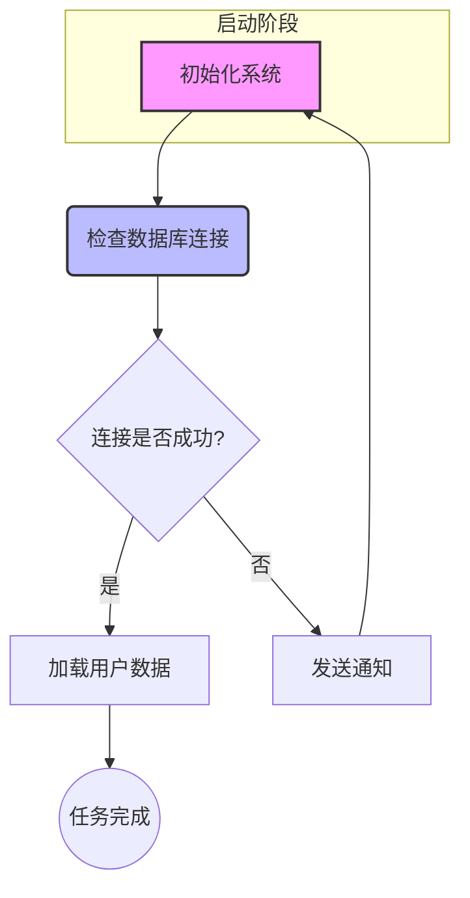
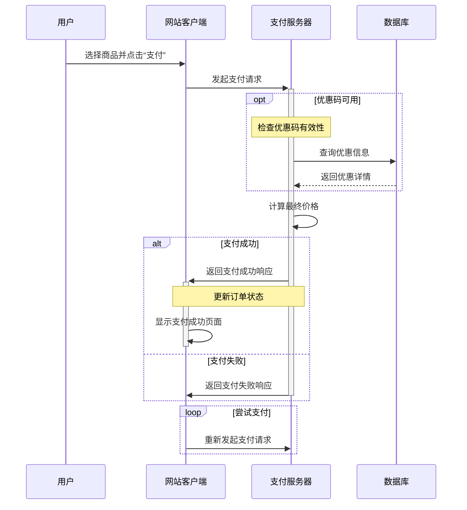
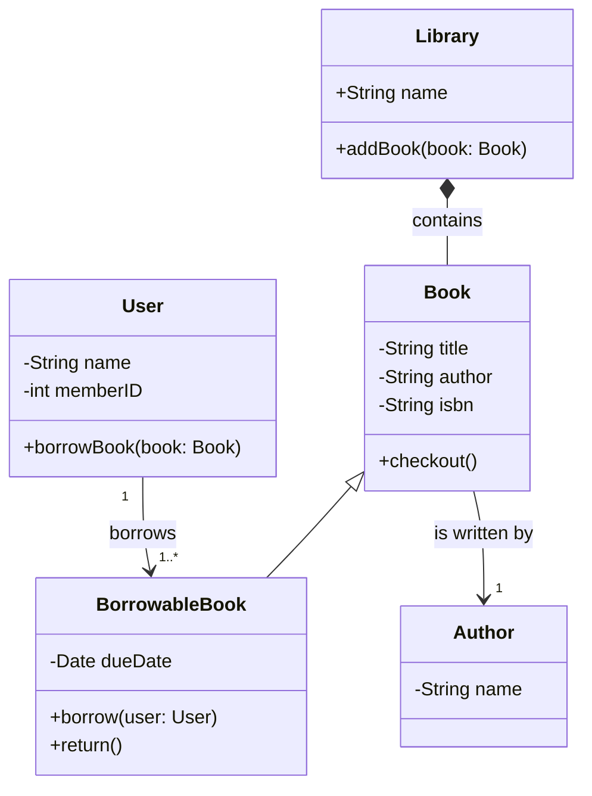
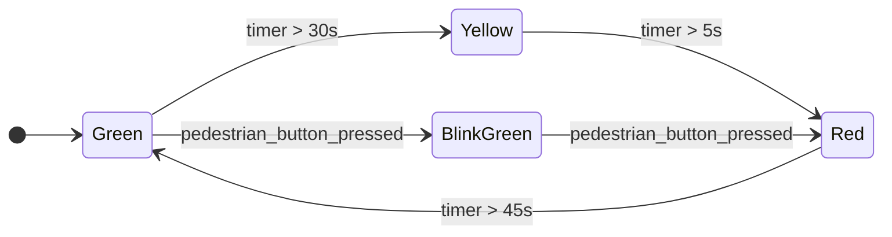
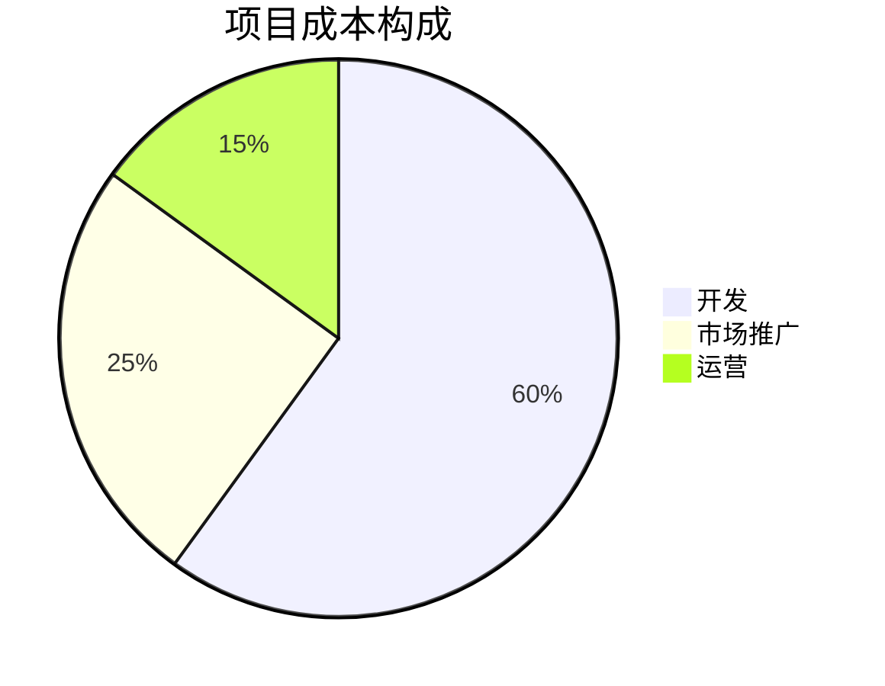

# mermaid入门   

---

## 介绍

mermaid是一种基于javascript的工具，使用一种简单、类似markdown的文本语言来快速生成各类图表和流程图   

且mermaid已经被广泛集成到许多流行的平台和工具中，像github和各类markdown编辑器和文档工具  

mermaid支持生成多种类型的图表，例如：
- 流程图（flowchart）
- 序列图（sequene diagram）
- 类图（class diagram）
- 状态图（state diagram）
- 甘特图（gantt chart）
- 饼图（pie chart）
- 以及用户旅程图，实体关系图等等  

---

## 基本语法  

无论画何种图，mermaid都遵循一个简单的模式：  

定义图表类型->定义图表元素->定义元素之间的关系

---

### 流程图  

流程图是最常用的图表之一，将一个复杂、抽象的过程或算法，以直观、易懂的方式呈现出来  

1. 定义图表类型和方向：流程图以 `graph`关键字开头，紧接着图表的方向   
	- `TD`：从上到下（Top-Down）
	- `LR`：从左到右
	- `RL`：从右到左
	- `BT`：从下到上（Bottom-Top） 

2. 定义节点：节点是流程图的基本组成部分，mermaid提供多种形状的节点   
	- `id[文本]`：矩形节点，`id`是节点唯一标识符，文本是显示在节点内部的文字
	- `id(文本)`：圆角矩形节点
	- `id{文本}`：菱形节点，用于决策和判断
	- `id((文本))`：圆形节点  

3. 定义连接线：连接线用于表示流程的流向    
	- `A ---> B`：实线箭头
	- `A --- B`：实现无箭头
	- `A -- 文本 --> B`：带文本标签的实线箭头
	- `A -.-> B`：虚线箭头
	- `A -. 文本 .-> B`：带文本标签的虚线箭头  

4. 演示代码  

```
graph TD
	subgraph 启动阶段
		A[初始化系统]
	end
	
	B(检查数据库连接)
	C{连接是否成功？}
	D[加载用户数据]
	E((任务完成))
	F[发送通知]
	
	A ---> B
	B ---> C
	C -- 是 --> D
	C -- 否 --> F
	D --> E
	F --> A
	
	style A fill:#f9f,stroke:#333,stroke-width:2px
	style B fill:#bbf,stroke:#333,stroke-width:2px
```

**注解：**   
- `subgraph 启动阶段 ... end`：定义一个子图，将A节点包含在一个逻辑组中，有利于组织复杂的图表  
- `style A fill:#f9f, ...`：mermaid的样式语法，给单个节点或连接线添加自定义功能  
	- `fill`：节点的填充颜色
	- `stroke`：节点的边框颜色
	- `stroke-width`：边框的宽度



---

### 序列图  

序列图用于描述系统中对象之间的交互顺序，关注消息在不同参与者之间如何、按什么顺序进行传递  

可以想象成一个剧本，它清晰的展示了“谁在什么时候对谁说了什么”，以及响应的顺序  

序列图主要由 **参与者（Participants）** 和 **消息（Messages）** 两部分组成  

1. 定义图表类型：所有序列图以 `sequenceDiagram`关键字开头

2. 定义参与者：使用 `participant`关键字来声明一个参与者，也可以给它起一个别名   
	-  `participant User`
	-  `participant App as 手机应用`  

3. 定义消息  ：消息是序列图的核心，描述了参与者之间的通信，消息用箭头表示，箭头的种类决定了消息的种类    
	- `->`：实线箭头，表示同步消息，发送方等待接收方响应
	- `-->>`：虚线箭头，表示异步消息或返回消息
	- `->>`：实线带开放箭头，表示异步消息
	- `->>+`：消息发送的同时，接收方分生命线被激活
	- `->>-`：发送消息后，接收方的生命线结束

4. 常见结构：mermaid支持一些结构来组织复杂的交互    
	- `Note over A,B:...`：在A和B之间添加一个注释
	- `loop ... end`：表示一个循环执行的交互
	- `opt ... end`：表示一个可选的交互
	- `alt ... else ... end`：表示一个选择结构

5. 演示代码 

```
sequenceDiagram
    participant User as 用户
    participant Client as 网站客户端
    participant Server as 支付服务器
    participant Database as 数据库
    
    User->>Client: 选择商品并点击“支付”
    Client->>+Server: 发起支付请求
    
    opt 优惠码可用
        Note over Server: 检查优惠码有效性
        Server->>Database: 查询优惠信息
        Database-->>Server: 返回优惠详情
    end
    
    Server->>Server: 计算最终价格
    
    alt 支付成功
        Server->>+Client: 返回支付成功响应
        Note over Client,Server: 更新订单状态
        Client->>-Client: 显示支付成功页面
    else 支付失败
        Server->>-Client: 返回支付失败响应
    end
    
    loop 尝试支付
        Client->>Server: 重新发起支付请求
    end
```



---

### 类图

类图是统一建语言（UML）中表示系统结构的静态图，用于描述面向对象系统中类，接口以及之间关系的图  

1. 定义图表类型：使用 `classDiagram`定义类图

2. 定义类
	- 定义类名：使用 `class`关键字
	- 定义成员：在类名后面跟上大括号 `{}`，然后在里面定义成员  
		- 字段：`可见性 字段名：类型`
		- 方法： `可见性 方法名（参数）：返回类型`
		- 可见修饰符：
			- `+`：公共
			- `-`：私有
			- `#`：保护

3. 定义关系
	- `A --|> B`：表示A继承自B
	- `A *-- B`：表示A由B组成
	- `A o-- B`：表示A聚合B
	- `A --->` ：表示A关联B

4. 演示代码

```
classDiagram
    class Library {
        +String name
        +addBook(book: Book)
    }

    class Book {
        -String title
        -String author
        -String isbn
        +checkout()
    }

    class BorrowableBook {
        -Date dueDate
        +borrow(user: User)
        +return()
    }

    class User {
        -String name
        -int memberID
        +borrowBook(book: Book)
    }
    
    class Author {
        -String name
    }

    Library *-- Book : contains
    Book <|-- BorrowableBook
    User "1" --> "1..*" BorrowableBook : borrows
    Book --> "1" Author : is written by
```



---

### 状态图

状态图用于描述一个对象在其生命周期中可能处于的不同状态，以及在特定事件发生时如何从一个状态转换到另一个状态的图 

1. 定义图表类型：使用 `stateDiagram-v2`定义状态图，其中v2表示第二版，mermaid创建的更强大的版本

2. 定义状态
	- 基本状态：
		- 使用 `state`关键字
		- 在转换中定义，`状态名：状态描述`
	- 初始状态和终止状态
		- `[*]`：表示初始状态和终止状态，每个状态图都应该有的两个特殊状态  

3. 定义状态转换
	- `状态1 ---> 状态2`
	- `状态1 ---> 状态2: 事件 [条件]`

4. 演示代码

```
stateDiagram-v2
    direction LR
    
    [*] --> Green
    
    state Green 
    state Yellow
    state Red 
    state BlinkGreen
     
	Green --> Yellow: timer > 30s
	Yellow --> Red: timer > 5s
	Red --> Green: timer > 45s
	BlinkGreen --> Red: pedestrian_button_pressed
    Green --> BlinkGreen: pedestrian_button_pressed
```



---

### 饼图

一种直观的图表类型  

1. 定义图表类型：使用`pie`关键字声明饼图

2. 添加标题（可选）：`使用` `title`关键字来添加图表标题

3. 定义数据：每行定义一个数据点，格式为 `"标签" : 数值`  

4. 演示代码

```
pie
    title 项目成本构成
    "开发" : 60
    "市场推广" : 25
    "运营" : 15
```



---
