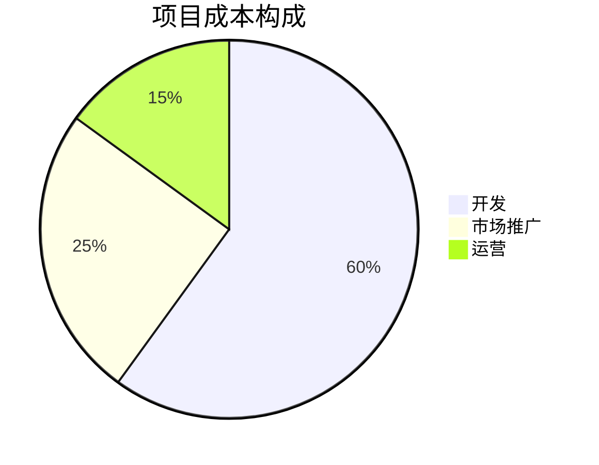

### 饼图

一种直观的图表类型  

1. 定义图表类型：使用`pie`关键字声明饼图

2. 添加标题（可选）：`使用` `title`关键字来添加图表标题

3. 定义数据：每行定义一个数据点，格式为 `"标签" : 数值`  

4. 演示代码

```
pie
    title 项目成本构成
    "开发" : 60
    "市场推广" : 25
    "运营" : 15
```



---
