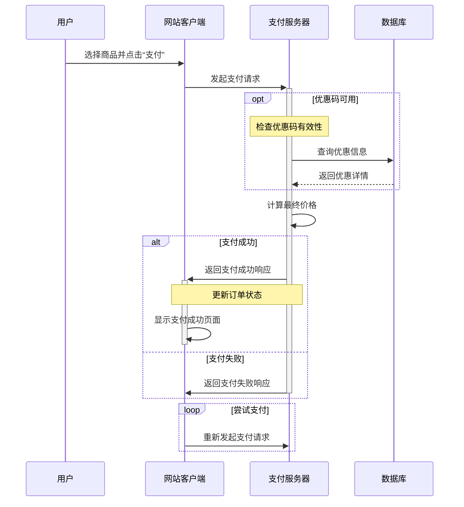

### 序列图  

序列图用于描述系统中对象之间的交互顺序，关注消息在不同参与者之间如何、按什么顺序进行传递  

可以想象成一个剧本，它清晰的展示了“谁在什么时候对谁说了什么”，以及响应的顺序  

序列图主要由 **参与者（Participants）** 和 **消息（Messages）** 两部分组成  

1. 定义图表类型：所有序列图以 `sequenceDiagram`关键字开头

2. 定义参与者：使用 `participant`关键字来声明一个参与者，也可以给它起一个别名   
	-  `participant User`
	-  `participant App as 手机应用`  

3. 定义消息  ：消息是序列图的核心，描述了参与者之间的通信，消息用箭头表示，箭头的种类决定了消息的种类    
	- `->`：实线箭头，表示同步消息，发送方等待接收方响应
	- `-->>`：虚线箭头，表示异步消息或返回消息
	- `->>`：实线带开放箭头，表示异步消息
	- `->>+`：消息发送的同时，接收方分生命线被激活
	- `->>-`：发送消息后，接收方的生命线结束

4. 常见结构：mermaid支持一些结构来组织复杂的交互    
	- `Note over A,B:...`：在A和B之间添加一个注释
	- `loop ... end`：表示一个循环执行的交互
	- `opt ... end`：表示一个可选的交互
	- `alt ... else ... end`：表示一个选择结构

5. 演示代码 

```
sequenceDiagram
    participant User as 用户
    participant Client as 网站客户端
    participant Server as 支付服务器
    participant Database as 数据库
    
    User->>Client: 选择商品并点击“支付”
    Client->>+Server: 发起支付请求
    
    opt 优惠码可用
        Note over Server: 检查优惠码有效性
        Server->>Database: 查询优惠信息
        Database-->>Server: 返回优惠详情
    end
    
    Server->>Server: 计算最终价格
    
    alt 支付成功
        Server->>+Client: 返回支付成功响应
        Note over Client,Server: 更新订单状态
        Client->>-Client: 显示支付成功页面
    else 支付失败
        Server->>-Client: 返回支付失败响应
    end
    
    loop 尝试支付
        Client->>Server: 重新发起支付请求
    end
```



---
