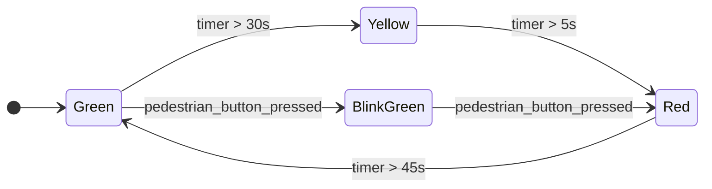

### 状态图

状态图用于描述一个对象在其生命周期中可能处于的不同状态，以及在特定事件发生时如何从一个状态转换到另一个状态的图 

1. 定义图表类型：使用 `stateDiagram-v2`定义状态图，其中v2表示第二版，mermaid创建的更强大的版本

2. 定义状态
	- 基本状态：
		- 使用 `state`关键字
		- 在转换中定义，`状态名：状态描述`
	- 初始状态和终止状态
		- `[*]`：表示初始状态和终止状态，每个状态图都应该有的两个特殊状态  

3. 定义状态转换
	- `状态1 ---> 状态2`
	- `状态1 ---> 状态2: 事件 [条件]`

4. 演示代码

```
stateDiagram-v2
    direction LR
    
    [*] --> Green
    
    state Green 
    state Yellow
    state Red 
    state BlinkGreen
     
	Green --> Yellow: timer > 30s
	Yellow --> Red: timer > 5s
	Red --> Green: timer > 45s
	BlinkGreen --> Red: pedestrian_button_pressed
    Green --> BlinkGreen: pedestrian_button_pressed
```



---
